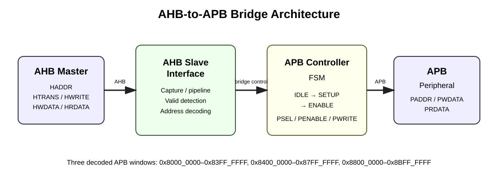
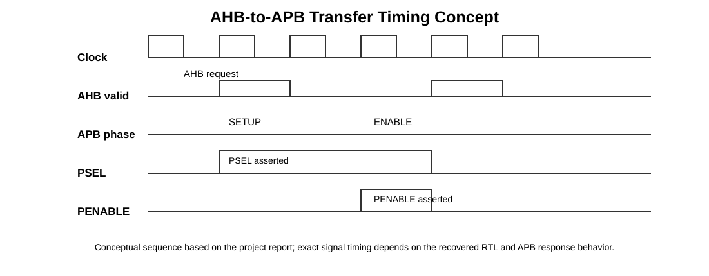

# AHB-to-APB Bridge using Verilog HDL

A compact RTL implementation of an **AMBA AHB-to-APB bridge**. The bridge behaves as an **AHB slave** toward a high-performance system bus and as an **APB master** toward low-power peripherals. It translates valid AHB read/write activity into the APB **SETUP → ENABLE** transfer sequence.

> **Project context:** recovered and organized from the author's original Verilog/ModelSim project archive and project report. The repository is intentionally kept close to the recovered implementation rather than presented as a completely new protocol implementation.

## What the project contains

```text
AHB Master / Test Stimulus
        │
        ▼
┌───────────────────────┐
│    AHB Slave          │
│    Interface          │
│  capture / pipeline   │
│  valid + address map  │
└──────────┬────────────┘
           │
           ▼
┌───────────────────────┐
│     APB Controller    │
│       FSM             │
│ IDLE → SETUP → ENABLE │
└──────────┬────────────┘
           │
           ▼
┌───────────────────────┐
│       APB Master      │
│ PSEL PENABLE PWRITE   │
│ PADDR PWDATA          │
└──────────┬────────────┘
           │
           ▼
      APB Peripheral
```

### Address decoding used by the recovered RTL

| AHB address range | APB select |
|---|---|
| `0x8000_0000 – 0x83FF_FFFF` | `PSEL[0]` |
| `0x8400_0000 – 0x87FF_FFFF` | `PSEL[1]` |
| `0x8800_0000 – 0x8BFF_FFFF` | `PSEL[2]` |

The project report describes the same bridge responsibilities: capture/decode AHB transactions, generate APB SETUP/ENABLE timing, select the target peripheral, and return APB read data to the AHB side.

## RTL structure

- `src/bridge/ahb_slave_interface.v` — AHB-side capture, pipelining, validity detection and peripheral address decoding.
- `src/bridge/apb_controller.v` — bridge control FSM and APB output generation.
- `src/bridge/bridge_top.v` — top-level integration of the AHB slave interface and APB controller.
- `sim/ahb_master.v` — simulation stimulus for single and burst-oriented read/write sequences.
- `sim/apb_slave_model.v` — lightweight APB-side simulation model used to provide read data.
- `sim/top_tb.v` — top-level ModelSim testbench.

## Verification scope

The recovered project contains test tasks for:

- Single write
- Single read
- Incrementing burst write
- Incrementing burst read

The project report states that functional simulation was performed in **ModelSim** and synthesis was performed using **Intel Quartus Prime**, targeting **Cyclone V / 5CSXFC6D6F31I7ES**. The report also documents single and burst transaction waveforms and an RTL synthesis view.

### Visual documentation





The original archive also contains ModelSim screenshots and synthesis snapshots; those generated captures are not all reproduced as repository binaries, while the source RTL and project documentation are retained here.

## Tools

| Item | Recovered project setup |
|---|---|
| HDL | Verilog HDL |
| Simulation | ModelSim |
| Synthesis | Intel Quartus Prime |
| FPGA family | Cyclone V |
| Device | `5CSXFC6D6F31I7ES` |

## Running the simulation

The recovered archive contains a ModelSim project configuration. A typical flow is:

1. Compile the Verilog sources under `src/bridge/` and `sim/`.
2. Start `top_tb`.
3. Select the bridge and AHB/APB signals in the waveform window.
4. Enable the desired transaction task in `sim/top_tb.v`.

The recovered testbench currently selects the burst-read task by default. The other transaction calls are left in the testbench as commented alternatives.

## Important recovery note

This repository is a **reconstruction of an earlier project**, not a claim that every generated simulator/Quartus artifact from the original workstation is source-controlled. Generated files such as ModelSim waveform databases and Quartus compilation databases are intentionally excluded.

One obvious signal-name typo in the recovered top-level wrapper was normalized (`temp_selx` → `temp_sel`) so that the module connections are internally consistent. No new bridge architecture or protocol behavior has been added beyond organizing the recovered project.

The APB simulation model is intentionally simple and is not intended to represent a production APB peripheral.

## Documentation

- [Project report summary](docs/project_report.md)
- [Bridge architecture notes](docs/architecture.md)
- [Verification notes](docs/verification.md)
- [ModelSim notes](modelsim/README.md)

## Future extensions

The original project notes identify further work such as expanding burst handling and adding arbitration/generalized master behavior. A production-quality bridge could also add stronger protocol checking, configurable peripheral windows, explicit error response handling, and a more complete APB slave model.

## License

Released under the **MIT License**. See [`LICENSE`](LICENSE).

AMBA, AHB and APB are specifications/terms associated with Arm. This project is an independent educational RTL implementation and is not an Arm product or official Arm implementation.
